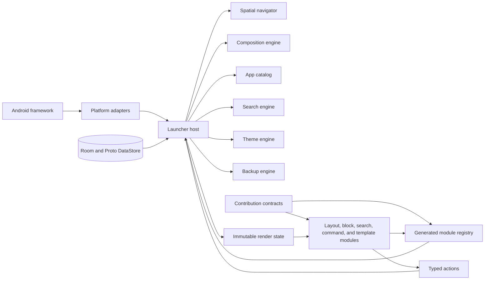

# Quicklauncher architecture and implementation plan

Status: confirmed design, ready for implementation planning

Quicklauncher is an Android 15 home app where users arrange destinations on a two-dimensional map and choose how each destination looks and behaves. A traditional grid can sit at the center, search can sit above it, and an alphabetical app list can sit to its right. Layouts and blocks come from build-time Gradle modules, so adding a new presentation does not require changing navigation, persistence, package discovery, profile policy, or Android integration code.

The canonical project language lives in [CONTEXT.md](../../CONTEXT.md). The decisions behind this plan live in [docs/adr](../adr).

## Product constraints

| Concern | Decision |
| --- | --- |
| Platform | Android 15, API 35 minimum; phones in portrait and landscape |
| UI | Kotlin and Jetpack Compose; `AndroidView` only for host-owned widget views |
| Distribution | Stable and preview GitHub Releases consumed through separate Obtainium configurations |
| Google dependencies | No Google Play Store distribution and no Google Play Services dependencies |
| License | Apache License 2.0 |
| Extension authors | Developers working in this repository |
| Runtime plugins | Not supported |
| First public build | Blocked until every first-release contribution contract and its versioning path has a dedicated specification |
| Clone | Data model prepared in 1.0; linked-clone UI ships later |
| Other-launcher import | Not supported in 1.0 |

## Architecture at a glance



The host is the policy owner. Modules receive prepared state and emit typed actions. They do not read Room, call `LauncherApps`, allocate widget IDs, inspect notifications, launch arbitrary intents, or decide whether private-profile data is visible.

## Deep module map

Each row below names a deep module, its small interface, and the complexity hidden behind it. Production and test adapters meet at the same seams.

| Module | Interface | What the implementation hides |
| --- | --- | --- |
| Module registry | `ContributionRegistry` | KSP discovery, duplicate IDs, contract-major validation, metadata validation, codec registration, test-kit registration |
| Composition engine | `CompositionEngine` | Layout activation, block trees, typed-slot validation, configuration loading, instance scopes, settings editors, safe fallback, quarantine |
| Spatial navigator | `SpatialNavigator` | Connected-grid rules, gesture thresholds, nested-scroll handoff, edge-only mode, neighbor previews, Home behavior, predictive Back coexistence |
| App catalog | `AppCatalog` | `LauncherApps`, profile serials, package callbacks, private and work policy, shortcuts, app overrides, folders, favorites, notification indicators |
| Search engine | `SearchEngine` | Provider concurrency, permission state, privacy filtering, cancellation, deterministic ranking, history decay, typed action execution |
| Widget host | `WidgetHost` | ID allocation, consent, configuration, options, one-view-per-ID behavior, removal, backup remapping, pending rebinds |
| Theme engine | `ThemeEngine` | Material color generation, fonts, icon packs, backgrounds, contrast values, asset limits, system wallpaper confirmation |
| Persistence engine | `LauncherStore` | Room transactions, Proto DataStore, JSON codecs, migrations, raw-data preservation, connectivity checks, drop commits |
| Backup engine | `BackupLibrary` | SAF folder grants, archive scanning, previews, encryption, nightly rotation, import validation, pre-restore backup, widget placeholders |
| Permission coordinator | `PermissionCoordinator` | Home role, runtime permissions, special access, restricted settings, denial behavior, contextual explanations |
| Recovery module | `RecoveryController` | crash-loop markers, instance quarantine, safe-layout substitution, diagnostic bundle creation |

The deletion test applies to each module. Removing the search engine, for example, would force provider cancellation, ranking, privacy, permissions, history, and action validation into every search presentation. That concentration of behavior is why the module earns its interface.

## Gradle project structure

Start with the following shape. Do not split modules further until a second implementation or a meaningful dependency rule justifies a new seam.

```text
:app
:contracts:domain
:contracts:contribution
:contracts:ui
:registry:annotations
:registry:ksp
:host:runtime
:host:data
:host:platform
:host:editor
:host:settings
:host:backup
:testing:contracts
:testing:fakes

:modules:layout:grid
:modules:layout:single-block
:modules:layout:safe
:modules:block:alphabetical-apps
:modules:block:app-grid
:modules:block:search
:modules:block:favorites-dock
:modules:block:folder
:modules:block:widget
:modules:block:clock-date
:modules:search:apps
:modules:search:shortcuts
:modules:search:contacts
:modules:search:files
:modules:search:settings
:modules:search:graphene-settings
:modules:search:web
:modules:commands:core
:modules:templates:core
```

Dependency rules:

- `:modules:*` may depend on `:contracts:domain`, `:contracts:contribution`, and `:contracts:ui`.
- A contribution module may not depend on `:host:*`, `:app`, Room entities, another contribution implementation, or Android launcher adapters.
- `:host:*` may depend on contracts but not on a contribution implementation.
- `:app` chooses the installed contribution modules and receives the generated registry.
- `:registry:ksp` validates all registered descriptors during compilation.
- `:testing:contracts` contains the mandatory black-box test suites every contribution runs.
- Stable and preview are product flavors with different application IDs, signing keys, Obtainium configuration, and persistent storage.

Enforce these rules with a dependency-analysis check in CI. A module that reaches around an interface should fail the build.

## Contribution contracts

The first release has five contribution types. Each has a versioned code contract and independently versioned persisted configuration.

### Common descriptor

Every contribution declares immutable metadata:

```kotlin
data class ContributionDescriptor(
    val id: ContributionId,
    val contractMajor: Int,
    val displayName: TextResource,
    val description: TextResource,
    val capabilities: Set<CapabilityId>,
    val requiredCapabilities: Set<CapabilityId>,
    val settings: SettingsSchema?,
    val configType: ConfigTypeId,
)
```

`ContributionId`, `CapabilityId`, `SlotTypeId`, and `ConfigTypeId` are namespaced stable strings registered at build time. Raw strings never cross the persistence interface. The KSP processor catches duplicates, missing codecs, unsupported contract majors, capability cycles, invalid settings schemas, and missing contract-test declarations.

### Layout module

A layout arranges one destination and exposes typed slots. The composition engine owns loading, persistence, lifecycle, and failure recovery.

```kotlin
interface LayoutModule {
    val descriptor: LayoutDescriptor

    @Composable
    fun Render(input: LayoutRenderInput)
}

data class LayoutRenderInput(
    val instance: ModuleInstanceId,
    val state: LayoutRenderState,
    val slots: SlotRenderer,
    val actions: ActionSink,
)
```

`LayoutRenderState` contains resolved theme values, window information, editor mode, background contrast, immutable placement state, and prepared content. It contains no Room entity, Android launcher object, or mutable host model.

### Block module

A block renders inside a compatible slot. A block may expose its own typed child slots, but the registry rejects cycles and unsupported nesting. The core single-block layout can promote any compatible block to fill a destination.

```kotlin
interface BlockModule {
    val descriptor: BlockDescriptor

    @Composable
    fun Render(input: BlockRenderInput)
}
```

The host gives widget blocks a host-owned widget renderer. It gives app blocks a policy-filtered `AppCollection`. It gives folder blocks shared folder state. Those blocks never acquire the underlying Android objects themselves.

### Search-provider module

Search retrieval varies independently from search presentation.

```kotlin
interface SearchProviderModule {
    val descriptor: SearchProviderDescriptor

    fun open(input: SearchProviderInput): SearchProviderSession
}

interface SearchProviderSession : AutoCloseable {
    val results: Flow<List<ProviderResult>>
    fun updateQuery(query: SearchQuery)
    override fun close()
}
```

The search engine owns debouncing, cancellation, permission state, result normalization, profile filtering, ranking, and action execution. Providers return typed result data and action IDs, never arbitrary executable intents.

### Launcher-command module

Commands are registered actions that can appear in search results, gesture settings, item menus, recovery UI, or other host-owned surfaces.

```kotlin
interface LauncherCommandModule {
    val descriptor: CommandDescriptor
    suspend fun execute(input: CommandInput): CommandResult
}
```

The host validates availability and permissions before calling a command. Commands return a result so callers can report success, cancellation, missing access, or recoverable failure.

### Destination-template module

Templates create ordinary destinations and module instances. They do not create special destination types.

```kotlin
interface DestinationTemplateModule {
    val descriptor: TemplateDescriptor
    fun create(input: TemplateInput): DestinationDraft
}
```

The first-run templates are:

- Modular sample: grid start destination at the center, search above, alphabetical apps to the right.
- Traditional: grid start destination plus an adjacent app grid.
- Blank: one empty grid destination with recovery controls still available through host UI.

### Settings contract

Standard settings use a declarative schema for booleans, choices, bounded numbers, dimensions, colors, fonts, app selectors, and capability-dependent fields. The host renders those controls consistently.

A module may register a custom settings editor for spatial or interactive configuration. In the destination editor, selecting the layout background exposes layout settings; selecting a block exposes that block's settings control. Custom editors still receive immutable state and emit typed actions.

### Contract evolution

Code contracts and saved configuration do not share a version number.

- Each contribution declares the supported contract major.
- Backward-compatible descriptor additions use defaults within a contract major.
- A breaking code change increments the contract major and updates all in-repository implementations together.
- Each configuration document has its own `schemaVersion` and sequential pure migrations.
- Migration failures preserve the original JSON and quarantine only the affected instance.
- New contribution types extend the generated registry without changing existing persisted type IDs.

Before the first preview build, create one specification per contribution type under `docs/contracts/`. Each specification must describe invariants, lifecycle, errors, accessibility, performance, configuration, and its black-box contract suite.

## Composition and typed slots

The composition engine stores a constrained tree of module instances.

- A selected layout instance is the root of a destination's active tree.
- Layouts and compatible blocks expose named slots.
- A slot descriptor declares its registered type, accepted block kinds, required capabilities, size rules, allowed scroll axes, and multiplicity.
- A block descriptor declares its kind, supplied capabilities, required host state, and size policy.
- The editor evaluates compatibility before a drag can enter a slot.
- A valid drop commits one Room transaction when the user releases the item.
- An invalid drop returns the item to its prior placement.
- There is no general undo stack.
- Destructive removal of a destination, configured widget, folder, or linked clone group requires confirmation. Empty blocks may delete immediately.

Switching a destination's layout selects a different root tree. The prior layout tree and versioned configuration stay dormant. Switching back restores its exact placements and settings. The safe layout remains non-removable and does not rely on optional modules.

Copy and clone use different configuration identities:

- Copy creates new module-instance, placement, and configuration-document IDs. It retains references to shared folders, favorites, and other semantic content. Widgets receive new Android bindings.
- Clone, after 1.0, creates new instance and placement IDs but shares the configuration document. Structural and setting changes propagate across the clone group. Widgets remain independently bound.

## Spatial destination map

Destinations occupy unique integer coordinates on an unbounded grid. The start destination has a stable ID independent of its coordinates.

Map invariants:

- Exactly one destination may occupy a coordinate.
- Every destination must remain reachable from the start through cardinal neighbors.
- Diagonal-only contact does not create a connection.
- Adding a destination requires an empty cell adjacent to the connected map.
- Moving or deleting a destination cannot strand another destination.
- The map editor may move a connected group as one operation.
- Coordinates do not rotate when the phone orientation changes. Right remains screen-right and above remains screen-up.

The map editor is a zoomed-out host-owned view for creating, moving, renaming, selecting, and deleting destinations. The destination editor handles blocks and layout settings. Keeping these as separate editor modes gives each drag one meaning.

### Gesture routing

One-finger cardinal drags belong to spatial navigation. Compose nested scrolling resolves conflicts:

1. Scrollable module content consumes movement while it can scroll.
2. At the content's scroll limit, unconsumed movement passes to the spatial navigator.
3. The navigator reveals and composes the adjacent destination.
4. A completed threshold settles on the neighbor; otherwise the current destination returns to rest.

Users may enable edge-only navigation. Its activation band sits inside the system Back edge and does not request system gesture exclusion. Non-navigation gestures such as double tap, pinch, and two-finger swipe map to typed commands through one collision-checking resolver.

The runtime composes the current destination and only the cardinal neighbors required for previews. Distant destinations keep durable configuration but no live Compose tree, coroutine scope, widget view, or animation.

Android Back closes host overlays, search, editors, and sheets through predictive Back. The launcher root does not reinterpret Back as movement to the left. A Home intent closes transient UI and navigates to the configured start destination. Ordinary process recreation restores the current destination when a new Home intent did not cause the restoration.

## Persistence model

Room stores structured launcher state. Proto DataStore stores global preferences such as gesture mode, enabled search providers, search history policy, theme selection, notification style, and onboarding state.

The initial Room model should contain these concepts:

| Record | Purpose and key constraints |
| --- | --- |
| `Destination` | Stable ID, name, integer `x` and `y`, start flag; unique coordinate and exactly one start destination |
| `DestinationLayout` | One retained layout root per destination and layout type; one selected layout per destination |
| `ModuleInstance` | Stable instance ID, contribution ID, configuration-document reference, lifecycle status |
| `ConfigurationDocument` | Namespaced config type, schema version, JSON payload, migration and quarantine status |
| `Placement` | Parent module instance, slot ID, child module instance, order, layout-owned placement JSON; acyclic tree |
| `ContentItem` | Shared folder, favorite, shortcut, or other host-owned semantic identity |
| `FolderMember` | Ordered references to content items |
| `AppOverride` | Profile serial, package and activity identity, custom label, icon, favorite, collection visibility, search visibility |
| `WidgetPlacement` | Module instance, widget ID, provider, profile, intended size, bind state, restore state |
| `ThemeProfile` | Named tokens, palette seed and roles, font references, icon-pack selection, optional embedded background |
| `DestinationBackground` | Optional destination-specific color, gradient, image, scrim, crop, and contrast metadata |
| `CrashMarker` | Instance, app version, startup attempt, timestamp, quarantine outcome |

Do not persist `UserHandle`. Persist the profile serial number and resolve the current handle through Android when needed. App and shortcut identities include the profile.

`LauncherStore` exposes task-level transactions rather than table repositories. Examples include `dropBlock`, `moveDestinationGroup`, `selectLayout`, `hideApp`, `replaceFromBackup`, and `quarantineInstance`. This keeps connectivity checks, widget cleanup, config references, and affected records inside one deep module.

Every edit follows these rules:

- Drag movement stays in memory until release.
- A valid release commits atomically.
- A failed commit leaves the prior state intact.
- Capabilities and graph invariants validate before the write.
- Settings save when the user commits the control.
- Raw unknown module data remains untouched until its module returns or the user explicitly deletes it.

## Android platform adapters

Android framework objects stop at `:host:platform`. Each production adapter has a fake used by host tests.

| Adapter | Responsibilities |
| --- | --- |
| Home role adapter | MAIN, HOME, and DEFAULT activity integration; role request; repeated Home intents |
| Launcher apps adapter | profile-aware app enumeration, change callbacks, launching, shortcut queries and pins |
| Profile adapter | profile serial resolution, work quiet mode, private lock state, badging and policy state |
| Widget adapter | `AppWidgetHost`, binding consent, configuration activity, host views, options, deletion, restore remapping |
| Notification adapter | notification-listener grant, eligible profile-aware dots or approximate counts, restricted-settings recovery |
| Wallpaper adapter | colors, crop preview, target selection, system and lock application, policy failures |
| Documents adapter | SAF folder and file grants, persisted permissions, bounded reads and writes |
| Permission adapter | runtime permission state, rationale, permanent denial, Settings recovery routes |
| Package adapter | broad package visibility, app details, uninstall and disable routes, resolvable intents |

Quicklauncher declares `QUERY_ALL_PACKAGES` because full device search is a core non-Play feature. Ordinary app collections still use `LauncherApps` rather than scanning arbitrary packages.

### Work profiles and Private Space

The app catalog converts Android profile data into policy-safe collections:

- Work identities always carry required badging.
- A layout may render work apps as a section or mix them into a badged list.
- Work-mode controls remain host actions because state changes can be asynchronous or require confirmation.
- Locked private apps never enter general app collections, search-provider input, suggestions, notification indicators, previews, diagnostics, or module state.
- Private Space lives in a host-owned secure overlay outside the destination map.
- The overlay remains reachable through a permanent map-overview command and an optional placeable block.
- Settings and backup previews must not reveal locked private app labels or icons.

### Widgets

Every widget placement owns a separate Android widget ID. Never share one ID across current and neighbor destinations, copied blocks, or alternate visible placements.

The widget host handles allocation, permission, provider configuration, `AppWidgetHostView`, size options, deletion, and backup remapping. A canceled or failed bind deletes the allocated ID. Dormant layout configurations keep their widget IDs until the user deletes the placement. Backup import creates pending widget placements and walks the user through allocating, binding, and configuring new IDs.

### Shortcuts and item actions

The host models a shortcut target with profile serial, package name, and shortcut ID. Visual placements remain separate because Android permits duplicate pinned shortcuts. After each placement change, the shortcut adapter recalculates the full pinned ID set for the package and profile.

Modules emit `OpenItemActions(itemId)` for long press. The host-owned action overlay resolves and validates shortcuts, app info, uninstall or disable, favorite, hide, rename, icon override, and profile actions.

Hiding an app always removes it from ordinary collections. The confirmation asks whether search may still reveal it. Settings retains an explicit recovery and launch entry either way.

### Notification indicators

Notification access is optional and host-owned. The adapter respects Android's badge eligibility and strips raw notification content before emitting profile-aware indicator state. Modules may render a dot, an approximate numeric count, or nothing. Numeric counts are presentation choices, not guaranteed unread totals. Private-profile indicators disappear immediately when the profile locks.

## Search architecture

`SearchEngine.open()` creates a session scoped to one visible search UI. The session fans a query out to enabled providers, cancels stale work, enforces provider timeouts, normalizes results, applies privacy and profile policy, ranks locally, and emits one immutable result list.

First-release providers:

- Apps through the host app catalog.
- Published shortcuts visible to Quicklauncher.
- Contacts through live `ContactsProvider` queries.
- User files inside selected SAF roots, with optional all-shared-storage access.
- A curated catalog of public Android Settings actions.
- A manually enabled GrapheneOS catalog with versioned best-effort routes and public fallbacks.
- HTTPS web suggestions through shipped or user-defined declarative adapters.
- Launcher commands.

Permission behavior is deliberate. Enabling a provider triggers its needed permission or special-access flow. Denial or later revocation switches that provider's saved setting off and removes its results. Other providers keep working.

Ranking is deterministic and local. It combines text match, user pins, provider relevance, and bounded decaying app or shortcut launch history. Users can disable and clear history. Quicklauncher never persists raw contact, file, or web queries.

Search results carry typed action IDs. The host validates the result against current profile, package, permission, and lock state before executing it. Presentation modules cannot launch raw intents.

User-defined web adapters support HTTPS URL templates plus bounded JSON-path, regular-expression, and HTML-selector extraction. They enforce response-size, timeout, redirect, and result-count limits. They contain no JavaScript, shell command, or executable plugin.

GrapheneOS routes are shown only if the current activity is exported, resolvable, and callable without an unheld permission. A public Android Settings parent is always available as fallback. Quicklauncher does not claim access to GrapheneOS's privileged search index.

## Theme architecture

The theme engine resolves a `LauncherTheme` supplied to every renderer. It owns:

- Material You and Material Expressive color generation through Material Color Utilities.
- Manual color roles and contrast settings.
- Named launcher-wide theme profiles.
- Bounded module overrides.
- Typography and user-imported font families.
- Corner radii, shapes, spacing, element density, and icon rendering.
- Nova and ADW `appfilter.xml` subset parsing.
- Per-app icon overrides and adaptive-icon fallback.
- Launcher-wide and per-destination backgrounds.

Palette sources include system wallpaper colors, a picked image, and a manual seed. Image-derived themes store the selected seed, generated roles, and a small preview. They retain the full image only when the user embeds it as the theme background.

Font import uses the system document picker. Quicklauncher copies accepted TTF, OTF, or TTC data into size-bounded private storage, validates it off the main thread, renders a representative preview, and keeps the prior font on failure. The first release supports static regular, bold, italic, and bold-italic faces plus variable fonts with curated axes.

An embedded theme image has two uses:

- Quicklauncher may render it as the host-managed launcher background, with optional per-destination overrides.
- Applying the theme may set Android wallpaper. Each application previews the crop, asks whether to target home, lock, or both, and warns that the displaced static or live wallpaper may not be recoverable.

Never feed the wallpaper-change callback caused by applying a theme back into the same palette-generation operation. Tag the application and suppress that loop.

## Backup, restore, and migration

The backup library is a host-owned Settings page inspired by Smart Launcher's visual snapshot library. Users choose a folder through SAF. Quicklauncher scans compatible archives already present in that folder and populates the UI.

Manual and automatic backups have separate pages. Each card shows a setup preview, user-facing name, timestamp, app version, schema version, manual or automatic label, encryption state, and validation status. Opening a card shows details and explicit restore, rename, export, and delete actions.

Automatic backups run nightly while charging. Keep the latest seven automatic archives. Never prune manual archives. Persist the SAF folder grant and surface a repair flow if the grant disappears.

Archive structure:

```text
manifest.json
database.json
preferences.pb
previews/
themes/
fonts/
backgrounds/
icons/
web-adapters/
```

The manifest records archive version, app version, required contract majors, included assets, content hashes, encryption parameters, and items requiring reauthorization. Passphrase encryption is recommended by default, with an explicit plaintext choice.

Restore flow:

1. Parse and validate the archive without changing live state.
2. Show the preview, compatibility report, missing modules, and reauthorization work.
3. Create an automatic backup of current state.
4. Migrate archive data in an isolated staging database.
5. Atomically replace the live map and preferences.
6. Quarantine invalid module instances rather than dropping their raw data.
7. Guide the user through permissions, document roots, profile mapping, shortcuts, and widget rebinding.

Themes and web adapters may import separately. Full map import replaces current state; it does not attempt coordinate or identity merging.

First-release migration means Quicklauncher schema migrations, Android backup restoration, and Quicklauncher archive import. Android provides no public generic path to read another launcher's workspace, shortcut pins, or widget IDs, so 1.0 does not claim that feature.

## Failure and recovery

A default home app must always expose a route back to app launching and Settings.

- The core safe layout cannot be removed or supplied by an optional contribution module.
- It shows an alphabetical app list, search command, map overview, and Settings.
- App visibility policy loads independently from the map aggregate. If that policy cannot be read, ordinary collections fail closed and host Settings retains a typed platform-app recovery list.
- Missing contribution code preserves raw instance configuration and shows an explanatory editor placeholder.
- Configuration migration failure quarantines only the affected instance.
- Renderer invocation uses a best-effort error guard and supervised coroutine scope.
- A startup marker detects repeated failure while restoring the same instance.
- After the crash-loop threshold, the next process start selects the safe layout and quarantines that instance.
- Users can inspect, reset, replace, export, or delete quarantined state.
- A bounded local diagnostic log records event types and stack traces but excludes queries, notification content, app inventory, private-profile labels, file paths, contact data, and imported adapter secrets.
- Nothing uploads automatically. The user may export a redacted support bundle.

In-process Compose cannot guarantee that every renderer exception stays inside its destination. The guarantee is recovery on the next launch, not perfect process isolation.

## Accessibility and input

Every contribution must pass the common accessibility contract:

- Complete TalkBack names, roles, states, and actions.
- Logical focus order across modules and host overlays.
- Font scaling without clipped essential controls.
- Theme contrast checks and resolved background contrast values.
- Reduced-motion alternatives for destination transitions and editor animations.
- D-pad and keyboard navigation.
- Non-drag commands for moving destinations and blocks.
- Predictive Back in overlays, editors, search, and Settings.
- Touch-target and gesture-conflict checks.

The map and destination editors expose move commands through accessible menus. Drag is never the only way to perform an edit.

## Security and privacy rules

- Modules receive policy-filtered immutable state, not Android objects or database handles.
- Locked private apps never cross the app-catalog or search interfaces.
- Imported fonts, backgrounds, icon packs, backup archives, and web adapters are untrusted input with explicit size, time, recursion, and parsing limits.
- User-defined web adapters require HTTPS and cannot execute code.
- Search-provider permissions are requested only in context.
- Notification content is never stored or sent to modules.
- Support bundles require explicit export and redact sensitive values.
- Signing secrets are unavailable to pull-request workflows.
- GitHub Actions use protected release environments, maintainer approval, least-privilege tokens, and actions pinned to immutable commits.

## Build and release

Stable and preview builds use separate application IDs, signing keys, GitHub release channels, storage, and Obtainium configurations. Each release contains exactly one universal installable APK. Extra assets may include checksums, provenance, an SBOM, and release notes, but no second APK candidate.

Release workflow:

1. A protected tag workflow runs formatting, static analysis, unit tests, module contract suites, instrumentation tests, screenshots, accessibility checks, migration tests, and macrobenchmarks.
2. The workflow requires maintainer approval before it can access the channel's signing secrets.
3. It reconstructs the channel-specific keystore in the runner's temporary storage.
4. It builds and signs the universal APK.
5. It verifies application ID, `versionName`, monotonically increasing `versionCode`, minimum SDK, signing certificate, and signature schemes.
6. It creates provenance for the final signed bytes and publishes the certificate fingerprint and APK SHA-256 digest.
7. It publishes a draft GitHub release, verifies the downloaded asset, then promotes the release.
8. Obtainium tracks stable and preview through separate preconfigured links.

Keep two encrypted offline backups of each signing key in separate locations. Document a planned Android v3 signing-lineage process. Key rotation still needs the old key, so backups remain necessary even though signing happens in CI.

The project publishes no preview or stable APK until the five first-release contribution contracts and their versioning rules have dedicated specifications. Internal test builds and throwaway prototypes are allowed before that gate.

## Testing strategy

Tests cross the same interfaces used by production callers. Do not expose Room DAOs, Android managers, or module internals merely to make tests convenient.

### Pure and property tests

- Destination-map connectivity, coordinate uniqueness, group moves, and deletion rejection.
- Slot compatibility, acyclic composition, capability resolution, and promotion through the single-block layout.
- Copy and future clone identity rules.
- Search ranking determinism, history decay, provider cancellation, and privacy filters.
- Theme token validation and palette golden values.
- Backup archive round trips, encryption, corruption handling, and deterministic migrations.
- Configuration migration sequences and raw-data preservation on failure.

### Contribution contract suites

Every registered contribution supplies:

- Descriptor and version validation.
- Configuration default, codec, and migration tests.
- Immutable state to typed action behavior tests.
- Preview fixtures for empty, normal, loading, permission-denied, profile-locked, large-text, and error states.
- Screenshot tests for supported orientations and theme modes.
- Accessibility semantics and focus-order tests.
- Lifecycle tests proving instance jobs stop after disposal.
- Performance checks appropriate to the contribution.

### Host integration tests

Use fake platform adapters for package changes, profiles, widgets, permissions, notifications, documents, and wallpaper. Test the deep host modules through their task-level interfaces. Instrumentation tests cover real role requests, widget bind flows, shortcut pins, Private Space on supported devices, notification access, wallpaper confirmation, SAF grants, and process restoration.

### Device and performance matrix

Release gates run on:

- API 35 AOSP emulator.
- The current GrapheneOS reference Pixel.

Stock Android Pixel and low-memory phone runs may add compatibility evidence when those devices are available. They do not block a phase or release.

Macrobenchmarks cover cold and warm Home entry, current-to-neighbor gestures, nested-scroll handoff, map overview, app-catalog load, local search latency, current-plus-neighbors memory, and safe-layout recovery. Establish numeric thresholds from baseline measurements on named devices, commit those thresholds, and treat regressions as release blockers.

## Implementation sequence

No phase below publishes an APK until phase 1 completes the contract documentation gate. Internal builds remain available for testing.

### Phase 0: project and risk spikes

- Create the Gradle structure, stable and preview flavors, dependency rules, CI skeleton, and Apache 2.0 license.
- Prototype Compose nested-scroll handoff between a vertical alphabetical list and vertical destination movement.
- Prototype one widget on the current destination plus a different widget ID in a live neighbor preview.
- Verify Home role, repeated Home intent, predictive Back, Private Space visibility, and GrapheneOS route checks on the required device matrix.
- Define the package and profile identity types before persistence work.

Exit criteria: each risky Android behavior has a small executable proof and a recorded result. No product code depends on an untested platform assumption.

### Phase 1: contracts and generated registry

- Write the five contract specifications under `docs/contracts/`.
- Implement domain IDs, descriptor DTOs, settings schema, immutable render inputs, typed actions, codecs, and contract-major declarations.
- Build the KSP registry and compile-testing suite.
- Build the contribution test kit and fake host state.
- Implement skeletal sample contributions that exercise every contract without becoming production UI.

Exit criteria: invalid IDs, versions, settings, capabilities, codecs, and missing tests fail compilation or CI. This satisfies the no-public-build architecture gate.

### Phase 2: persistence and spatial state

- Implement Room entities and task-level `LauncherStore` transactions.
- Implement Proto DataStore preferences.
- Add configuration documents and migration isolation.
- Implement connected-map operations with property tests.
- Implement drop commits, confirmations, dormant layout trees, copy, and clone-ready configuration references.

Exit criteria: randomized map edits never violate uniqueness or reachability; backupable state survives process recreation and schema upgrades.

### Phase 3: safe launcher vertical slice

- Implement the Home activity, role onboarding, package and profile adapters, app launching, and the safe layout.
- Implement the app catalog with profile serial identities and package callbacks.
- Implement host-owned Settings, map overview entry, quarantine inspection, automatic safe fallback,
  and contextual permission flows. Renderer retry is enabled only when a real renderer is installed.
- Add crash markers, quarantine, and local diagnostics.
- Use the working safe layout as the development-time preview before the explicit Home-role action.
  Do not add inert template choices before their layouts and blocks can render.

Exit criteria: Quicklauncher can become the default home app, launch profile-aware apps, return to the start destination on Home, and recover from a deliberately crashing test renderer.

### Phase 4: composition, navigation, and editors

- Implement the composition engine, instance scopes, typed slots, and capability validation.
- Implement current-plus-neighbor loading and spatial gestures.
- Add nested-scroll handoff and edge-only mode.
- Build map and destination editors with accessible non-drag alternatives.
- Implement grid, single-block, alphabetical-app, app-grid, favorites or dock, folder, and clock or date modules.
- Complete quarantined-module reset, replacement, and deletion through the real contribution and
  configuration editors. These actions must preserve the original document until the replacement
  validates; Phase 3 does not pretend to repair contributions that are not installed yet.
- Complete ADR 0028 onboarding with modular, traditional, and blank template selection and
  configuration before any public launcher build.

Exit criteria: the modular sample works end to end. A developer can add a test block in one Gradle module without changing host implementation code.

### Phase 5: widgets, shortcuts, profiles, and indicators

- Implement widget allocation, bind, configure, resize, copy, dormant-state, deletion, and restore flows.
- Implement pinned and dynamic shortcut discovery and duplicate placements.
- Implement work sections, work-mode actions, badging, and quiet-state handling.
- Implement the host-owned Private Space overlay and locked-data suppression.
- Implement optional notification indicators and restricted-settings onboarding.
- Complete the host-owned item action and folder overlays.

Exit criteria: widgets and shortcuts survive normal restart, profile state changes cannot leak private items, and modules receive only sanitized state.

### Phase 6: search

- Implement the search engine and typed action executor.
- Add apps, shortcuts, commands, contacts, files, public Settings, GrapheneOS, and web providers.
- Implement permission-driven provider disablement.
- Add deterministic ranking, bounded history, cancellation, timeouts, and privacy tests.
- Build the full-screen search block and nested search presentation.

Exit criteria: swapping search presentation does not change retrieval or ranking; locked private results never enter a session; a slow provider cannot delay the others.

### Phase 7: themes and backgrounds

- Implement Material You and Material Expressive generation.
- Build theme profiles, manual tokens, bounded module overrides, fonts, icon packs, and app icon overrides.
- Implement launcher backgrounds, per-destination overrides, wallpaper crop and target prompts, and loop suppression.
- Add import validation, size limits, palette goldens, screenshot coverage, and reduced-motion behavior.

Exit criteria: every reference module renders from the same host theme, invalid assets fall back safely, and applying a theme never changes system wallpaper without explicit target confirmation.

### Phase 8: backup and migration

- Define and publish the archive format.
- Implement user-selected folders, gallery scanning, previews, manual backups, and nightly seven-snapshot rotation.
- Add passphrase encryption, plaintext warning, staged validation, pre-restore backup, and atomic replacement.
- Add Android backup rules, permission reauthorization, widget rebinding, and profile review.
- Add quarantined-state and redacted support-bundle export.

Exit criteria: archive round trips pass across app versions, corrupt archives cannot alter live data, and restores always leave the safe layout reachable.

### Phase 9: release hardening

- Finish the full accessibility contract on every contribution.
- Establish and enforce performance thresholds on the device matrix.
- Audit broad package visibility, exported activities, file parsers, web adapters, Private Space, and logging.
- Configure separate signing environments and keys, provenance, checksums, SBOM, and Obtainium links.
- Restore both signing-key backups in a drill and verify throwaway signatures.
- Complete user documentation for role setup, restricted settings, backups, permissions, themes, recovery, and verification.

Exit criteria: every ADR and contract has test evidence, all release gates pass, and the downloaded draft APK verifies against the published application ID, certificate, digest, and source tag.

## First-release acceptance checklist

The stable 1.0 release is ready only when all items below are true:

- All five contribution specifications are complete and implemented.
- Grid home, alphabetical apps, app grid, search, widgets, folders, favorites or dock, clock or date, single-block, and safe modules pass their contract suites.
- Users can create, move, configure, switch, copy, and remove destinations and blocks without violating the spatial map.
- Home, work profiles, Private Space, shortcuts, widgets, notification indicators, predictive Back, and contextual permissions pass device tests.
- Search providers, ranking, privacy, typed actions, and permission behavior pass integration tests.
- Theme profiles, fonts, icon packs, backgrounds, and wallpaper prompts pass import and screenshot tests.
- Manual and automatic backup galleries, encryption, staged restore, and widget rebinding pass destructive test cases.
- Safe-layout and crash-loop recovery work after renderer and migration failures.
- Accessibility and performance gates pass on all reference devices.
- Stable and preview release workflows produce one correctly signed APK each with separate identities, provenance, certificate fingerprints, and digests.
- No Google Play Services dependency or unexpected telemetry endpoint appears in the dependency and network audit.

## Explicitly deferred

- Runtime third-party APK plugins.
- Linked-clone UI, though the configuration-document model supports it.
- Third-party launcher backup adapters.
- Tablet and foldable release support.
- Universal compatibility with every icon-pack dialect.
- Executable search adapter scripts.
- A public binary compatibility promise for contribution contracts.

These may become later design sessions. None should distort the first-release interfaces before a real need appears.

## Primary technical references

- [Android `LauncherApps`](https://developer.android.com/reference/android/content/pm/LauncherApps)
- [Android app-widget host guide](https://developer.android.com/develop/ui/views/appwidgets/host)
- [Android Private Space](https://source.android.com/docs/security/features/private-space)
- [Compose nested scrolling](https://developer.android.com/develop/ui/compose/touch-input/scroll/nested-scroll-modifiers)
- [Android package visibility](https://developer.android.com/training/package-visibility)
- [Android backup](https://developer.android.com/identity/data/autobackup)
- [Android `WallpaperManager`](https://developer.android.com/reference/android/app/WallpaperManager)
- [Material Color Utilities](https://github.com/material-foundation/material-color-utilities)
- [Obtainium source behavior](https://wiki.obtainium.imranr.dev/sources/)
- [Launcher release-signing comparison](../research/launcher-release-signing.md)
